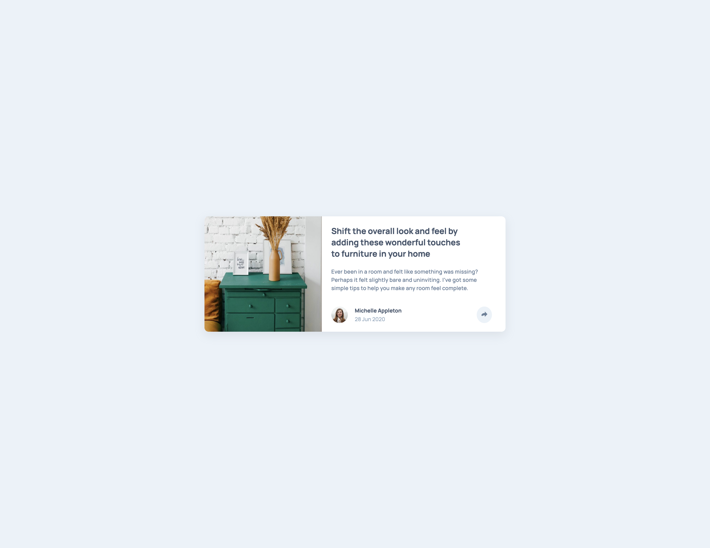
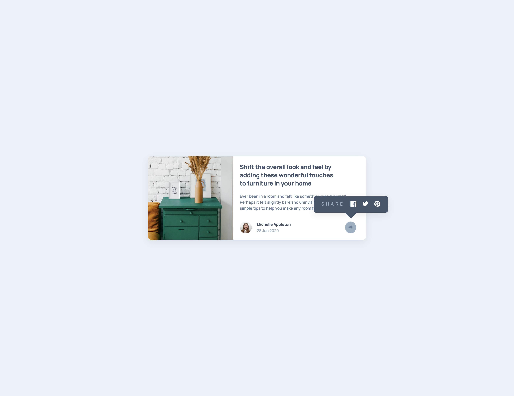
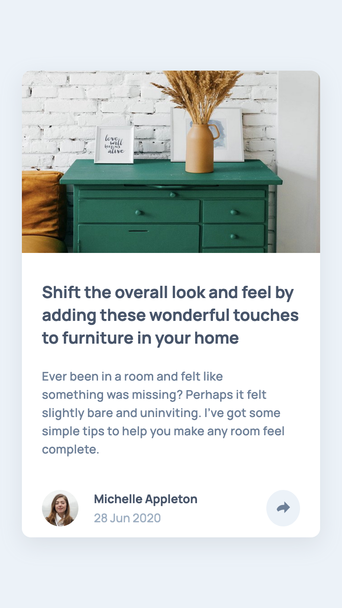
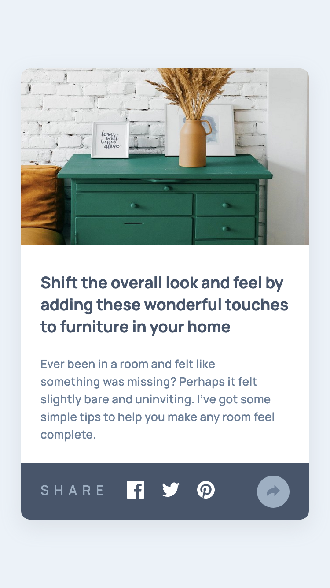

# Frontend Mentor - Article preview component solution

This is a solution to the [Article preview component challenge on Frontend Mentor](https://www.frontendmentor.io/challenges/article-preview-component-dYBN_pYFT). Frontend Mentor challenges help you improve your coding skills by building realistic projects. 

## Table of contents

- [Overview](#overview)
  - [The challenge](#the-challenge)
  - [Screenshot](#screenshot)
  - [Links](#links)
- [My process](#my-process)
  - [Built with](#built-with)
  - [What I learned](#what-i-learned)
  - [Useful resources](#useful-resources)
- [Author](#author)
## Overview

### The challenge

Users should be able to:

- View the optimal layout for the component depending on their device's screen size
- See the social media share links when they click the share icon

### Screenshot






### Links

- Solution URL: [https://github.com/hkparkjs/frontend-mentor-challenge/tree/main/article-preview-component-master](https://github.com/hkparkjs/frontend-mentor-challenge/tree/main/article-preview-component-master)
- Live Site URL: [https://park-article-preview-component.netlify.app](https://park-article-preview-component.netlify.app)

## My process

### Built with

- Semantic HTML5 markup
- CSS custom properties
- Flexbox
- CSS Grid
- Mobile-first workflow
- Javascript

### What I learned
While adding share popup for desktop screen, I learned how to get the current location of some element and the width of browser.
 - getBoundingClientRect()
 - resize event 
```js
/* Adjusting location after knowing location of specific element */
function adjustPopupLocation() {
  popup.style.top = `${shareBtn.getBoundingClientRect().top - 85}px`;
  popup.style.left = `${shareBtn.getBoundingClientRect().left - 105}px`;
}
...
/* Adjusting location whenever changine browser size */
window.addEventListener('resize', () => {
  if (isShow && screen.width >= 768) {  // only for desktop
    adjustPopupLocation();
  }
});
```
### Useful resources

- [MDN - Element.getBoundingClientRect()](https://developer.mozilla.org/en-US/docs/Web/API/Element/getBoundingClientRect)
- [MDN - resize event](https://developer.mozilla.org/en-US/docs/Web/API/Window/resize_event)

## Author

- Frontend Mentor - [@hkparkjs](https://www.frontendmentor.io/profile/hkparkjs)