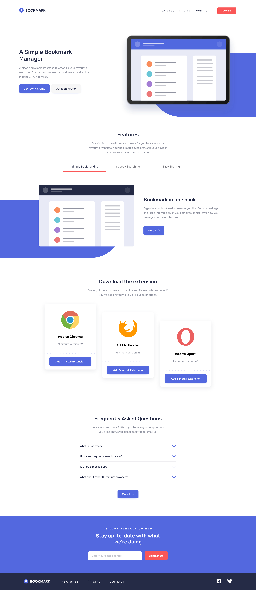
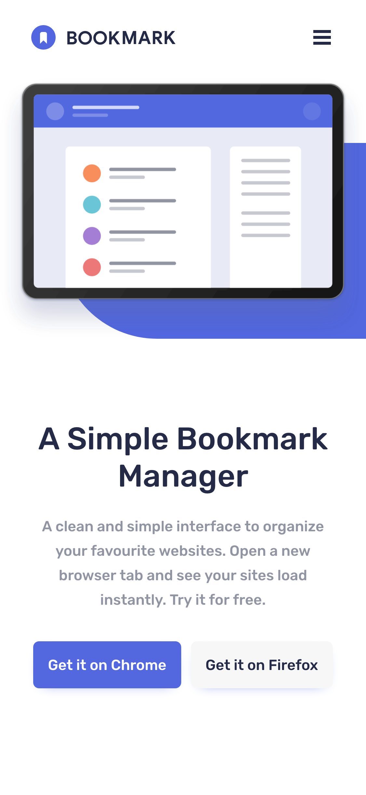
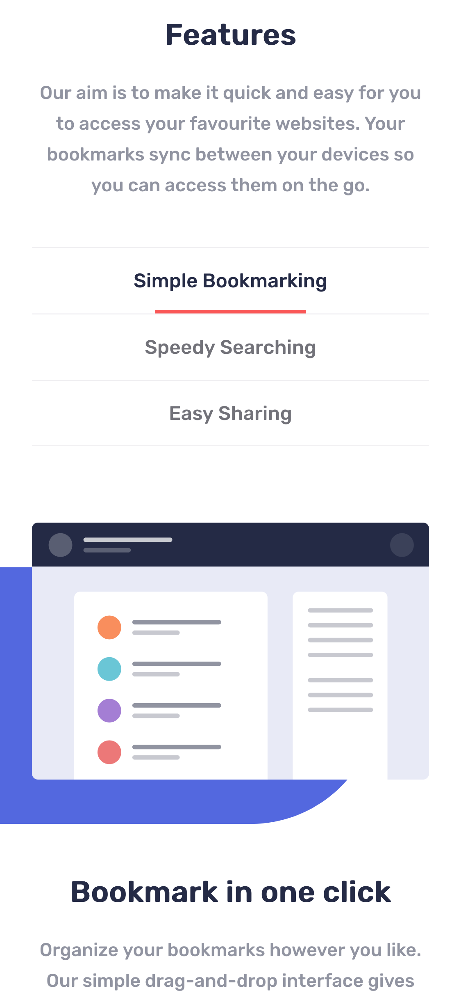
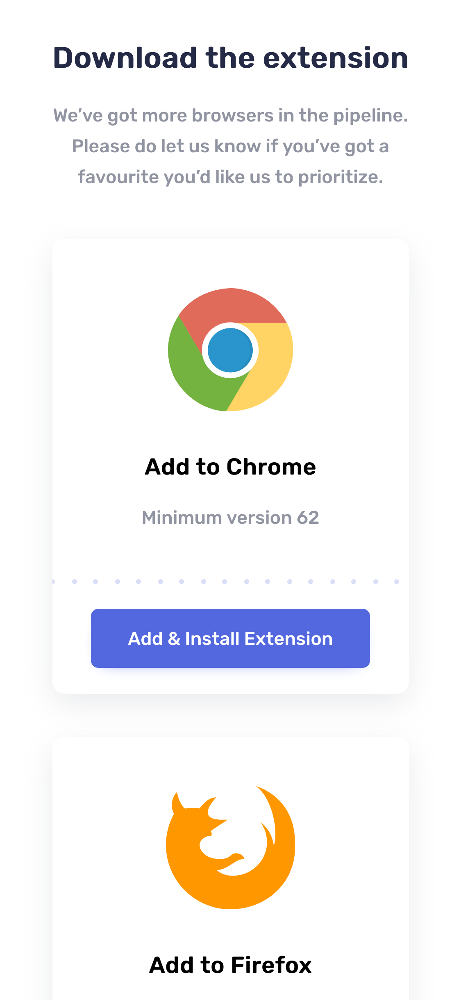
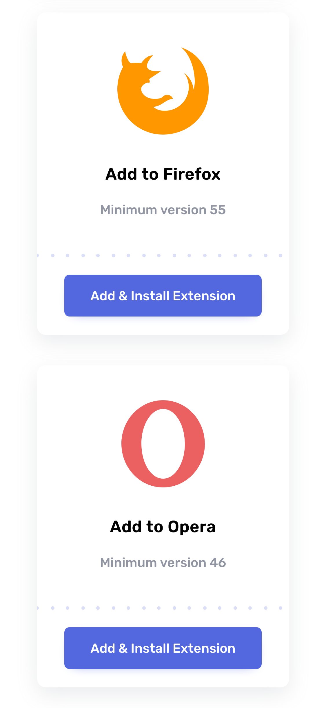
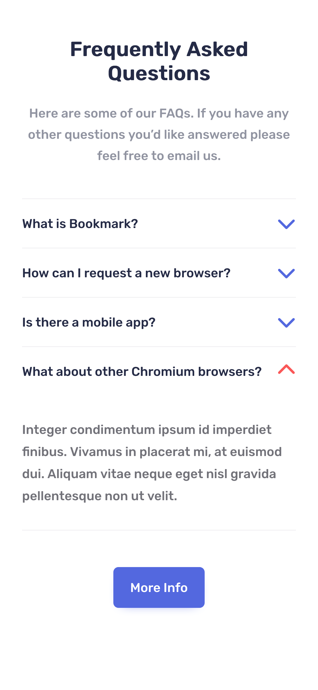
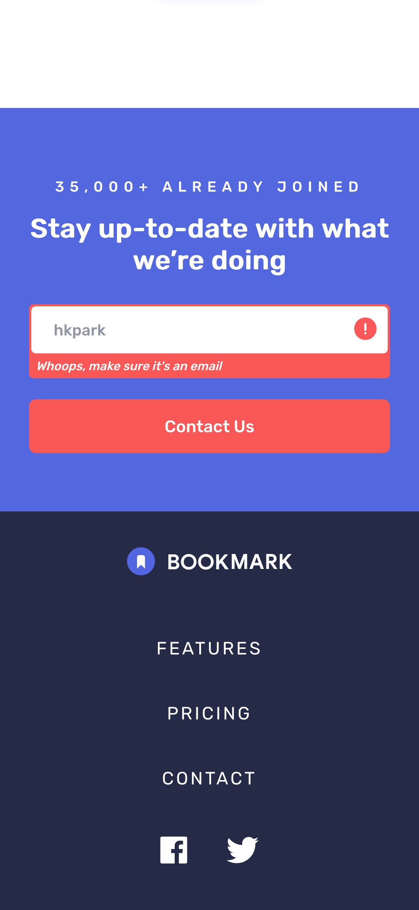
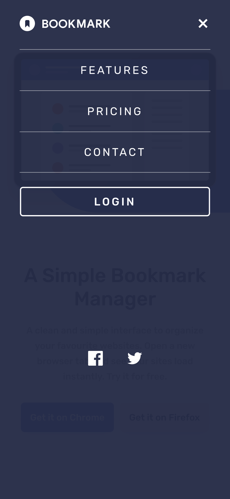

# Frontend Mentor - Bookmark landing page solution

This is a solution to the [Bookmark landing page challenge on Frontend Mentor](https://www.frontendmentor.io/challenges/bookmark-landing-page-5d0b588a9edda32581d29158). Frontend Mentor challenges help you improve your coding skills by building realistic projects.

## Table of contents

- [Overview](#overview)
  - [The challenge](#the-challenge)
  - [Screenshot](#screenshot)
  - [Links](#links)
- [My process](#my-process)
  - [Built with](#built-with)
  - [What I learned](#what-i-learned)
  - [Useful resources](#useful-resources)
- [Author](#author)

## Overview

### The challenge

Users should be able to:

- View the optimal layout for the site depending on their device's screen size ✔️
- See hover states for all interactive elements on the page ✔️
- Receive an error message when the newsletter form is submitted if:
  - The input field is empty ✔️
  - The email address is not formatted correctly ✔️

### Screenshot











### Links

- Solution URL: [https://github.com/hkparkjs/frontend-mentor-challenge/tree/main/bookmark-landing-page-master](https://github.com/hkparkjs/frontend-mentor-challenge/tree/main/bookmark-landing-page-master)
- Live Site URL: [https://park-bookmark-landing-page.netlify.app/](https://park-bookmark-landing-page.netlify.app/)

## My process

### Built with

- Semantic HTML5 markup
- CSS custom properties
- Flexbox
- Mobile-first workflow
- [Sass](https://sass-lang.com/) - CSS preprocessor
- [React](https://reactjs.org/) - JS library

### What I learned

I learned how to configure a sass architecture.

I also learned making mixins and variables and adding them to components for style.

```scss
/* You can import files in one time 
   when you use @forword in index file */

// styles/index.scss
@forward 'base'; // base directory
@forward 'mixins'; // mixins directory
```

```scss
/* import for using common sass configurations (variables, mixins...)
   When you add @use in a file, you can use the variables and mixins
   in the file locally.
*/

// components/Title/Title.scss
@use 'styles/index' as *;

.title {
  @include flexbox; // use flexbox mixin
  ...
}

```

### Useful resources

- [ARIA: Tab role](https://developer.mozilla.org/en-US/docs/Web/Accessibility/ARIA/Roles/tab_role) - This helped me for adding tabs.

## Author

- Frontend Mentor - [@hkparkjs](https://www.frontendmentor.io/profile/hkparkjs)
