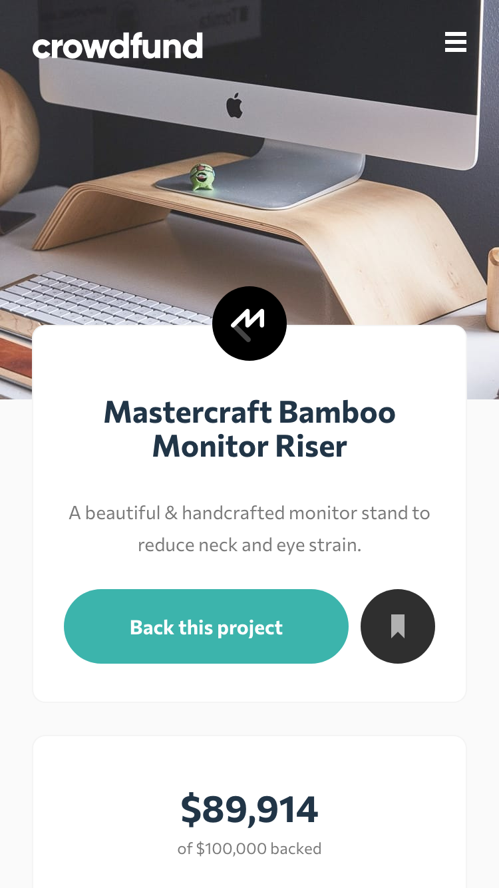
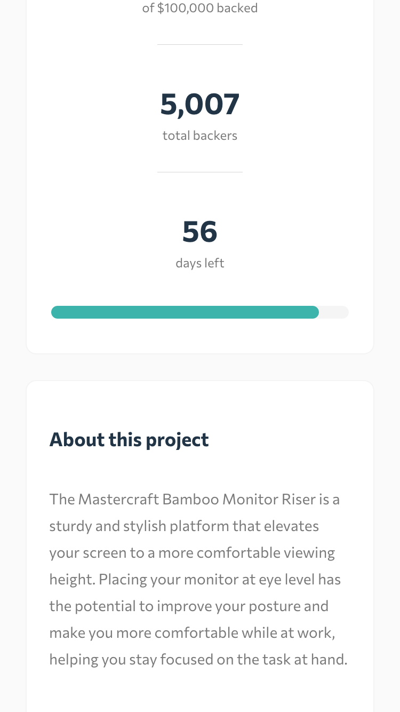
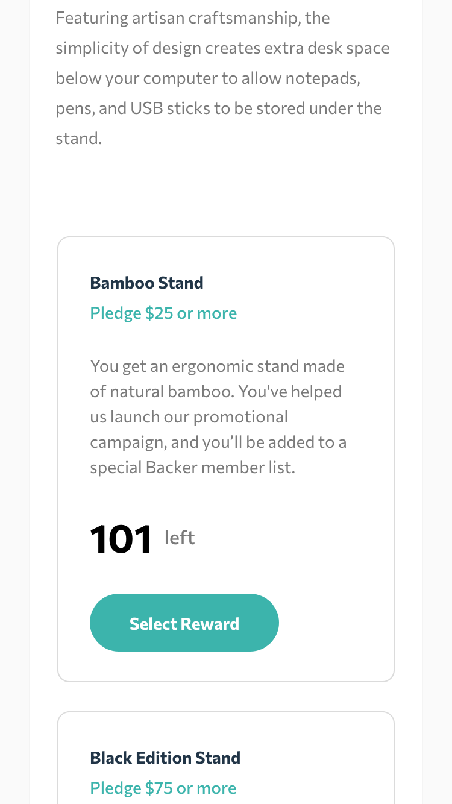
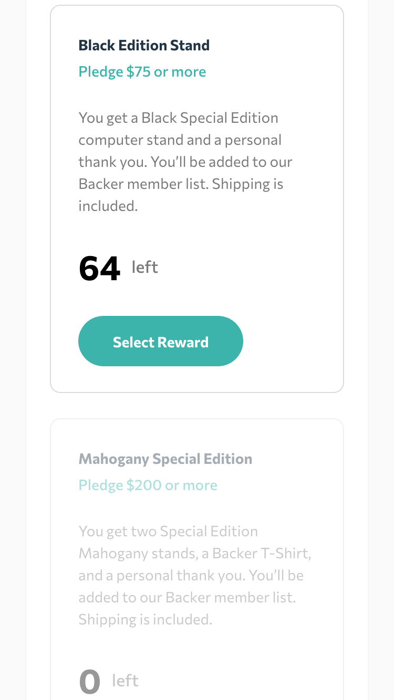
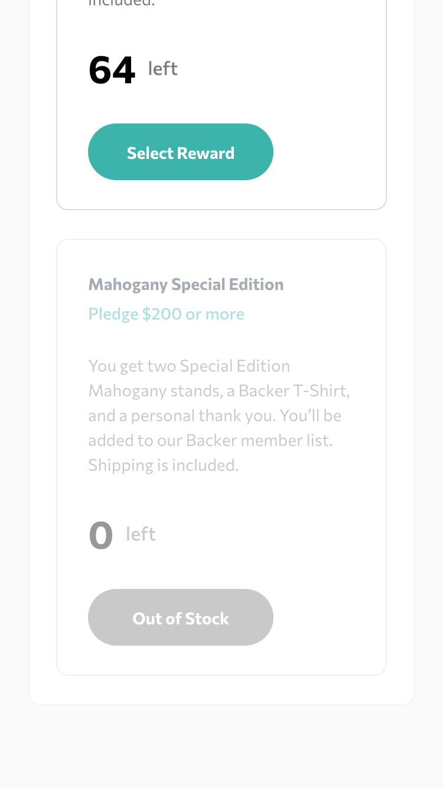
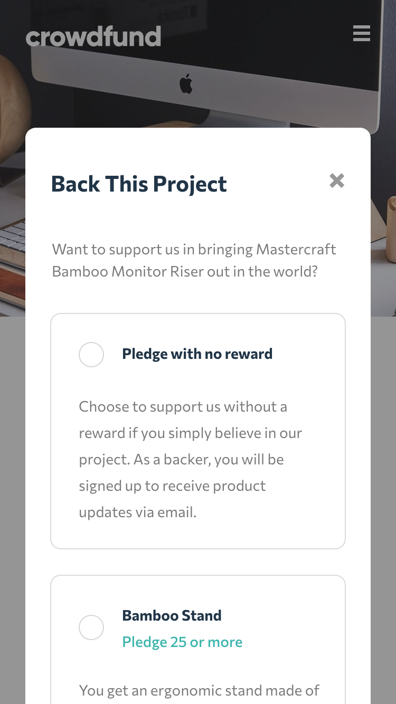
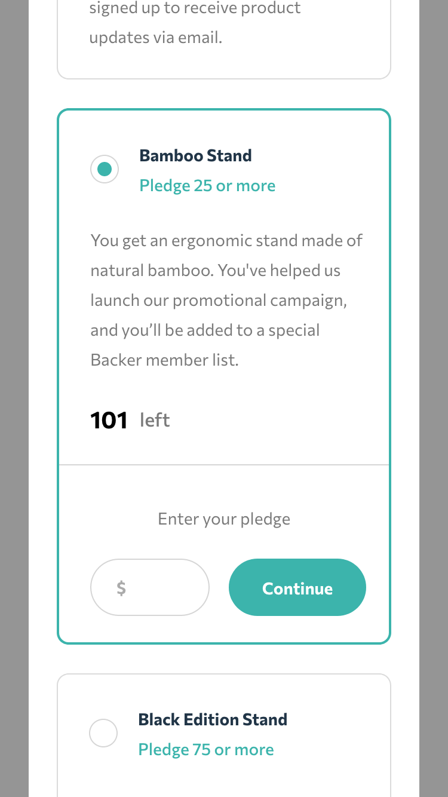
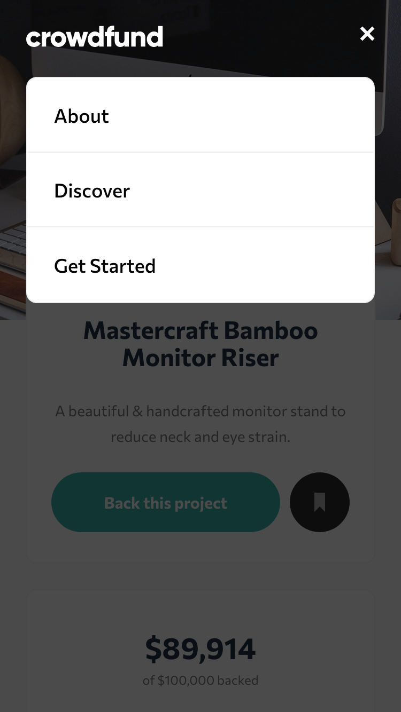
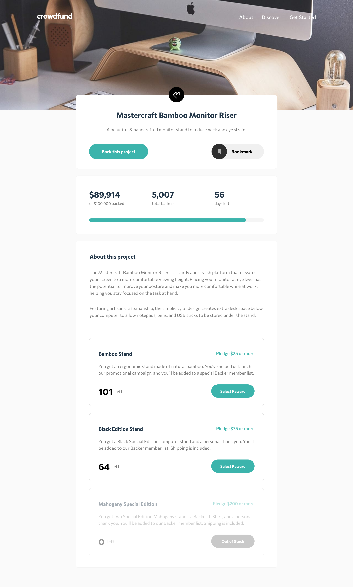
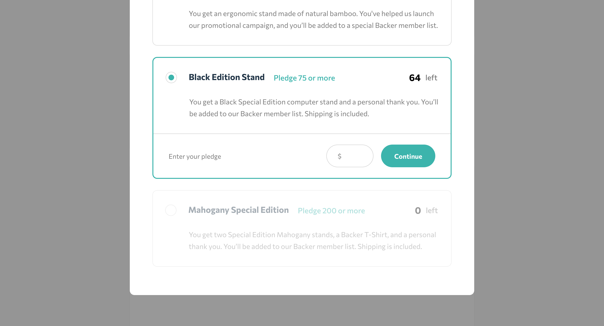

# Frontend Mentor - Crowdfunding product page solution

This is a solution to the [Crowdfunding product page challenge on Frontend Mentor](https://www.frontendmentor.io/challenges/crowdfunding-product-page-7uvcZe7ZR). Frontend Mentor challenges help you improve your coding skills by building realistic projects. 

## Table of contents

- [Overview](#overview)
  - [The challenge](#the-challenge)
  - [Screenshot](#screenshot)
  - [Links](#links)
- [My process](#my-process)
  - [Built with](#built-with)
  - [What I learned](#what-i-learned)
  - [Continued development](#continued-development)
- [Author](#author)

## Overview

### The challenge

Users should be able to:

- View the optimal layout depending on their device's screen size ✔️
- See hover states for interactive elements ✔️
- Make a selection of which pledge to make ✔️
- See an updated progress bar and total money raised based on their pledge total after confirming a pledge ✔️
- See the number of total backers increment by one after confirming a pledge ✔️
- Toggle whether or not the product is bookmarked ✔️

### Screenshot

### Links

- Solution URL: [https://github.com/hkparkjs/frontend-mentor-challenge/tree/main/crowdfunding-product-page-main](https://github.com/hkparkjs/frontend-mentor-challenge/tree/main/crowdfunding-product-page-main)
- Live Site URL: [https://park-crowdfunding-product-page.netlify.app/](https://park-crowdfunding-product-page.netlify.app/)

## My process

### Built with

- Semantic HTML5 markup
- CSS custom properties
- Flexbox
- Mobile-first workflow
- [React](https://reactjs.org/)
- [Vite](https://vitejs.dev/)

### What I learned

It's my first project using React, and I learned how to configure the structure for a react project and to manage state by using `useState()` and `useEffect()`.
Also, I learned how to make custom radio button.

### Continued development

I want to get accustomed to use react library and I have a plan to use `styled-component` and `Next.js`.

## Author

- Frontend Mentor - [@hkparkjs](https://www.frontendmentor.io/profile/hkparkjs)
