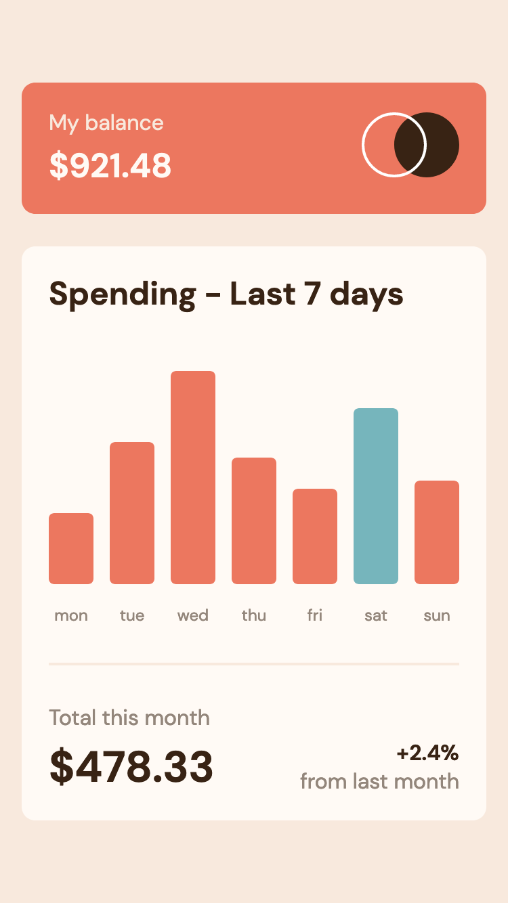
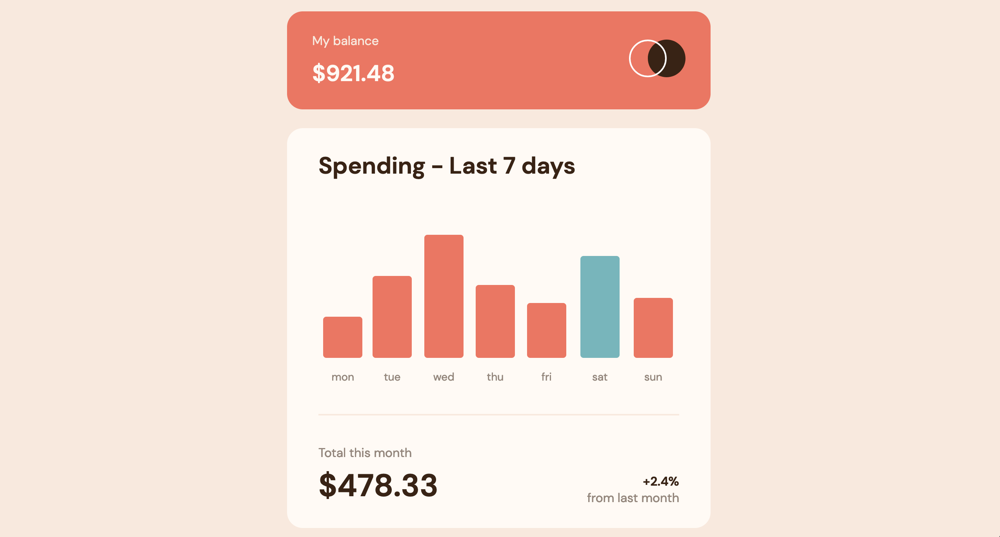
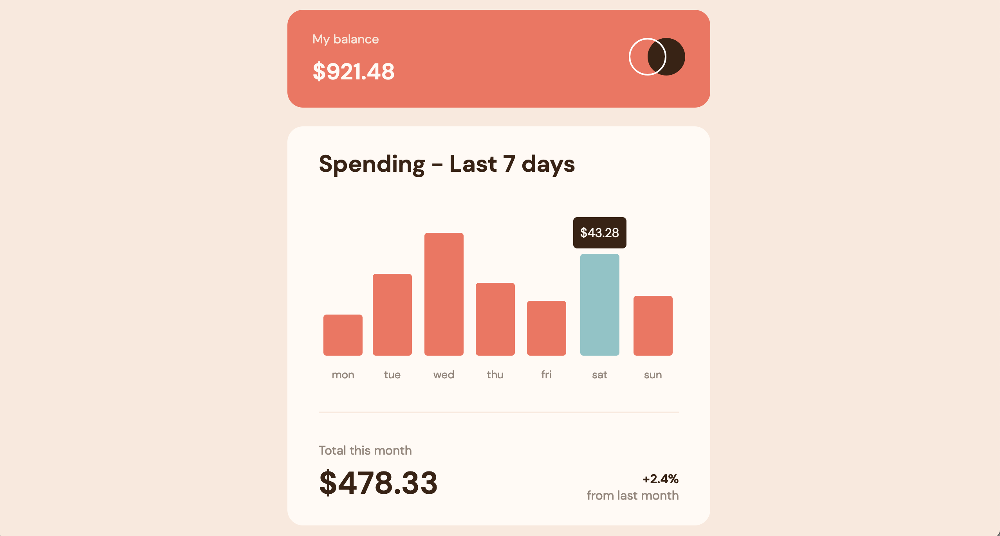

# Frontend Mentor - Expenses chart component solution

This is a solution to the [Expenses chart component challenge on Frontend Mentor](https://www.frontendmentor.io/challenges/expenses-chart-component-e7yJBUdjwt). Frontend Mentor challenges help you improve your coding skills by building realistic projects. 

## Table of contents

- [Overview](#overview)
  - [The challenge](#the-challenge)
  - [Screenshot](#screenshot)
  - [Links](#links)
- [My process](#my-process)
  - [Built with](#built-with)
  - [What I learned](#what-i-learned)
  - [Useful resources](#useful-resources)
- [Author](#author)

## Overview

### The challenge

Users should be able to:

- View the bar chart and hover over the individual bars to see the correct amounts for each day ✔️
- See the current day’s bar highlighted in a different colour to the other bars ✔️
- View the optimal layout for the content depending on their device’s screen size ✔️
- See hover states for all interactive elements on the page ✔️
- **Bonus**: Use the JSON data file provided to dynamically size the bars on the chart ✔️

### Screenshot





### Links

- Solution URL: [https://github.com/hkparkjs/frontend-mentor-challenge/tree/main/expenses-chart-component-main](https://github.com/hkparkjs/frontend-mentor-challenge/tree/main/expenses-chart-component-main)
- Live Site URL: [https://park-expenses-chart-component.netlify.app/](https://park-expenses-chart-component.netlify.app/)

## My process

### Built with

- Semantic HTML5 markup
- CSS custom properties
- Flexbox
- Mobile-first workflow

### What I learned

I learned how to use ```fetch()``` function to load dynamically json data and that I need to use ```.json()``` for getting the data to use.
I also came to know how to use ```async``` and  ```await```

### Useful resources
- [Fetch API - MDN](https://developer.mozilla.org/en-US/docs/Web/API/Fetch_API/Using_Fetch)
- [async function - MDN](https://developer.mozilla.org/en-US/docs/Web/JavaScript/Reference/Statements/async_function)
- [await - MDN](https://developer.mozilla.org/en-US/docs/Web/JavaScript/Reference/Operators/await)

## Author

- Frontend Mentor - [@hkparkjs](https://www.frontendmentor.io/profile/hkparkjs)