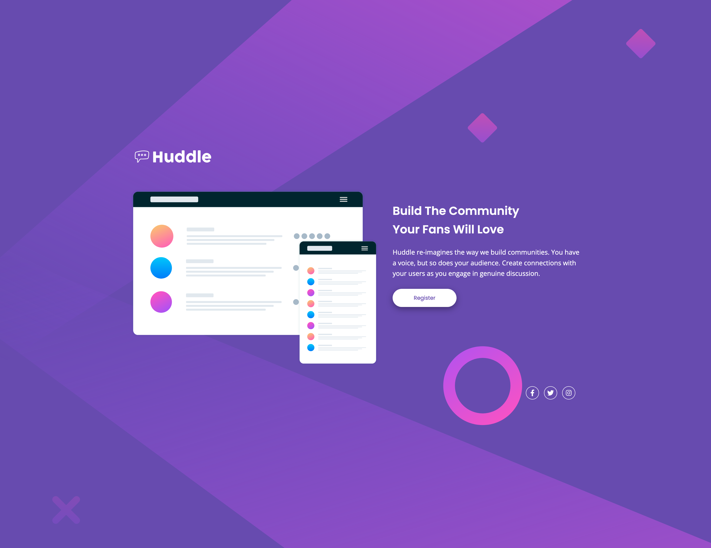

# Frontend Mentor - Huddle landing page with single introductory section solution

This is a solution to the [Huddle landing page with single introductory section challenge on Frontend Mentor](https://www.frontendmentor.io/challenges/huddle-landing-page-with-a-single-introductory-section-B_2Wvxgi0). Frontend Mentor challenges help you improve your coding skills by building realistic projects. 

## Table of contents

- [Overview](#overview)
  - [The challenge](#the-challenge)
  - [Screenshot](#screenshot)
  - [Links](#links)
- [My process](#my-process)
  - [Built with](#built-with)
  - [Useful resources](#useful-resources)
- [Author](#author)

## Overview

### The challenge

Users should be able to:

- View the optimal layout for the page depending on their device's screen size
- See hover states for all interactive elements on the page

### Screenshot

### Links

- Solution URL: [https://github.com/hkparkjs/frontend-mentor-challenge/tree/main/huddle-landing-page-with-single-introductory-section-master](https://github.com/hkparkjs/frontend-mentor-challenge/tree/main/huddle-landing-page-with-single-introductory-section-master)
- Live Site URL: [https://my-puddle-landing-page-with-single-in.netlify.app/](https://my-puddle-landing-page-with-single-in.netlify.app/)

## My process

### Built with

- Semantic HTML5 markup
- CSS custom properties
- Flexbox
- CSS Grid
- Mobile-first workflow

### Useful resources

- [Font Awesome](https://fontawesome.com/) - I used this library to get social icons.
- [IcoMoon](https://icomoon.io/)
- [Ionicons](https://ionicons.com/)

## Author

- Frontend Mentor - [@hkparkjs](https://www.frontendmentor.io/profile/hkparkjs)