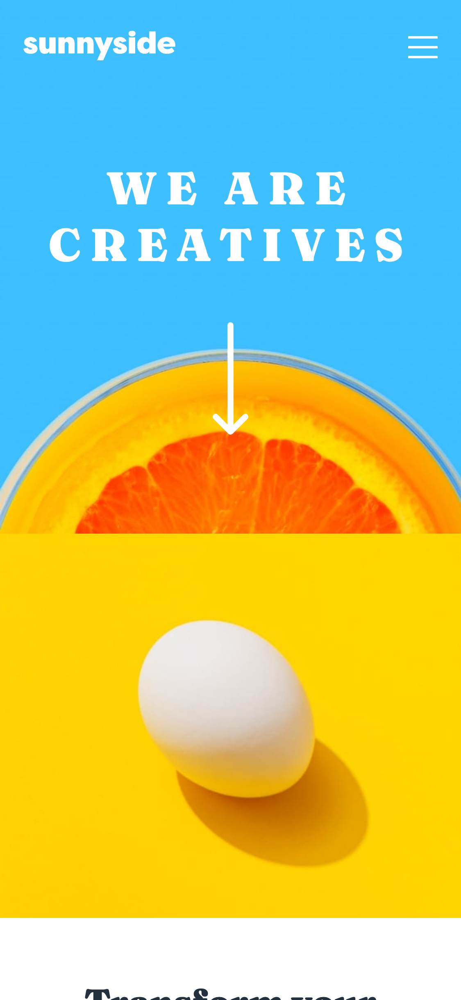

# Frontend Mentor - Sunnyside agency landing page solution

This is a solution to the [Sunnyside agency landing page challenge on Frontend Mentor](https://www.frontendmentor.io/challenges/sunnyside-agency-landing-page-7yVs3B6ef). Frontend Mentor challenges help you improve your coding skills by building realistic projects.

## Table of contents

- [Overview](#overview)
  - [The challenge](#the-challenge)
  - [Screenshot](#screenshot)
  - [Links](#links)
- [My process](#my-process)
  - [Built with](#built-with)
- [Author](#author)

## Overview

### The challenge

Users should be able to:

- View the optimal layout for the site depending on their device's screen size ✔
- See hover states for all interactive elements on the page ✔

### Screenshot

### Links

- Solution URL: [https://github.com/hkparkjs/frontend-mentor-challenge/tree/main/sunnyside-agency-landing-page-main](https://github.com/hkparkjs/frontend-mentor-challenge/tree/main/sunnyside-agency-landing-page-main)
- Live Site URL: [https://park-sunnyside-agency-landing-page.netlify.app/](https://park-sunnyside-agency-landing-page.netlify.app/)

## My process

### Built with

- Semantic HTML5 markup
- CSS custom properties
- Flexbox
- Mobile-first workflow

## Author

- Frontend Mentor - [@hkparkjs](https://www.frontendmentor.io/profile/hkparkjs)