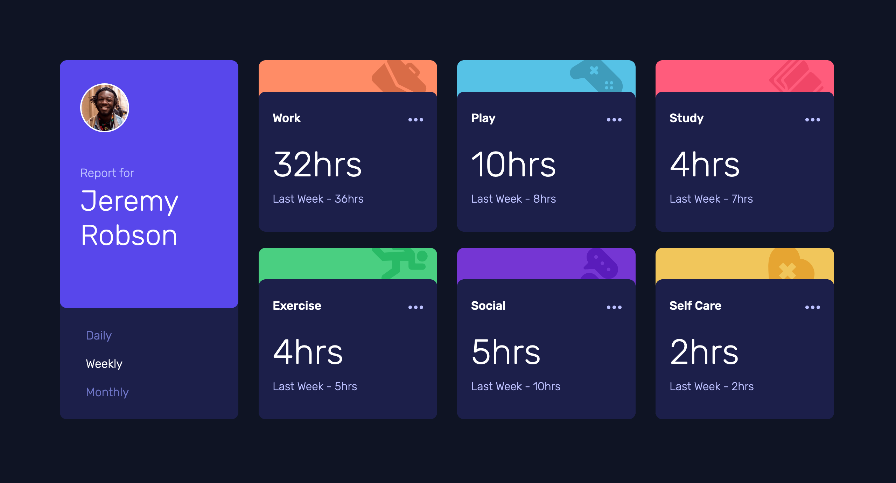
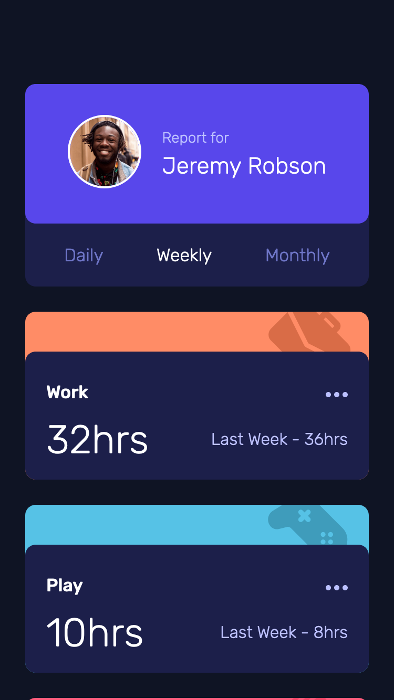
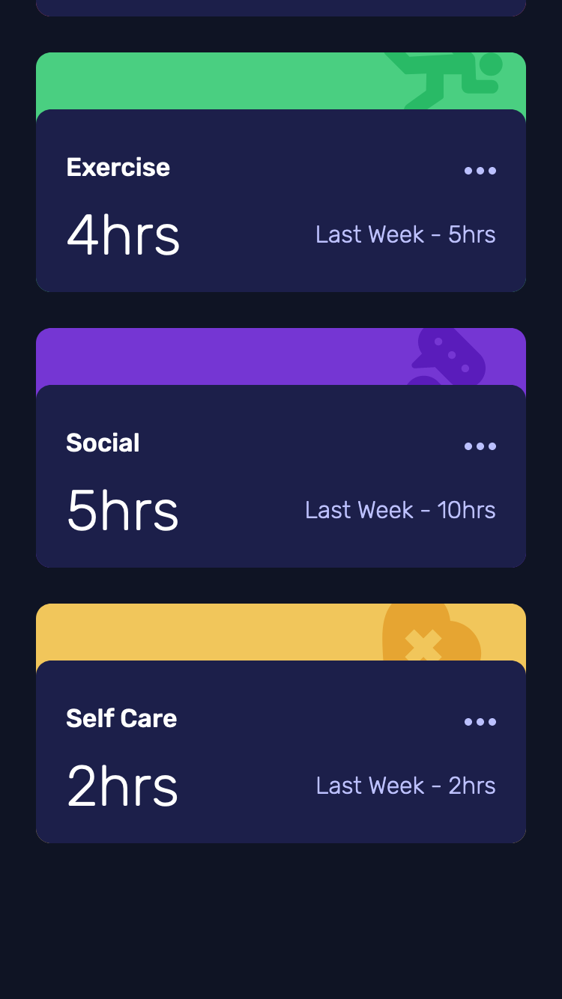

# Frontend Mentor - Time tracking dashboard solution

This is a solution to the [Time tracking dashboard challenge on Frontend Mentor](https://www.frontendmentor.io/challenges/time-tracking-dashboard-UIQ7167Jw). Frontend Mentor challenges help you improve your coding skills by building realistic projects. 

## Table of contents

- [Overview](#overview)
  - [The challenge](#the-challenge)
  - [Screenshot](#screenshot)
  - [Links](#links)
- [My process](#my-process)
  - [Built with](#built-with)
- [Author](#author)

## Overview

### The challenge

Users should be able to:

- View the optimal layout for the site depending on their device's screen size ✔️
- See hover states for all interactive elements on the page ✔️
- Switch between viewing Daily, Weekly, and Monthly stats ✔️

### Screenshot

### Links

- Solution URL: [https://github.com/hkparkjs/frontend-mentor-challenge/tree/main/time-tracking-dashboard-main](https://github.com/hkparkjs/frontend-mentor-challenge/tree/main/time-tracking-dashboard-main)
- Live Site URL: [https://park-time-tracking-dashboard.netlify.app/](https://park-time-tracking-dashboard.netlify.app/)

## My process

### Built with

- Semantic HTML5 markup
- CSS custom properties
- Flexbox
- Mobile-first workflow

## Author

- Frontend Mentor - [@hkparkjs](https://www.frontendmentor.io/profile/hkparkjs)